# 🎬 Vídeo 3.1 - SAST com Horusec

**Aula**: 3 - SAST, SCA e SBOM  
**Vídeo**: 3.1  
**Temas**: Shift-Left Security; SAST (Static Application Security Testing); Horusec; Detecção de vulnerabilidades no código

---

## 🚀 Antes de Começar

### Pré-requisitos

| Requisito | Como verificar |
|-----------|----------------|
| Git instalado | `git --version` |
| Docker instalado | `docker --version` |
| Conta GitHub | Acesso ao github.com |

### Primeira vez?
→ Faça fork do repositório `fiap-dclt-devsecops-aula03` para sua conta GitHub

---

## 📚 Parte 1: Conceitos Fundamentais

### Passo 1: O que é Shift-Left?

```mermaid
graph LR
    subgraph "Tradicional (Shift-Right)"
        A1[Design] --> B1[Dev] --> C1[Build] --> D1[Deploy] --> E1[🔒 Security]
    end
```

```mermaid
graph LR
    subgraph "DevSecOps (Shift-Left)"
        A2[🔒 Design] --> B2[🔒 Dev] --> C2[🔒 Build] --> D2[🔒 Deploy] --> E2[Ops]
    end
```





**Por que Shift-Left?**

| Quando encontra | Custo para corrigir |
|-----------------|---------------------|
| Design | $1 |
| Desenvolvimento | $10 |
| Testes | $100 |
| Produção | $1.000+ |

> **Quanto mais cedo encontrar, mais barato corrigir!**

---

### Passo 2: SAST vs SCA - Qual a diferença?

| Aspecto | SAST | SCA |
|---------|------|-----|
| **Significado** | Static Application Security Testing | Software Composition Analysis |
| **O que analisa** | SEU código fonte | Bibliotecas de terceiros |
| **Detecta** | SQL Injection, XSS, hardcoded secrets | CVEs em dependências |
| **Ferramenta** | Horusec, Semgrep, SonarQube | Trivy, Snyk, Dependabot |

```mermaid
graph TB
    A[Sua Aplicação] --> B[app.py - SEU CÓDIGO]
    A --> C[requirements.txt - DEPENDÊNCIAS]
    
    B --> D[SAST - Horusec]
    C --> E[SCA - Trivy]
```



---

### Passo 3: O que é CVE?

**CVE** = Common Vulnerabilities and Exposures

- Identificador único para vulnerabilidades conhecidas
- Formato: `CVE-YYYY-NNNNN`
- Mantido pelo MITRE Corporation
- Banco de dados: [cve.org](https://cve.org)

**Exemplos famosos:**

| CVE | Nome | O que foi |
|-----|------|-----------|
| CVE-2021-44228 | **Log4Shell** | RCE no Log4j, afetou milhões de sistemas |
| CVE-2014-0160 | **Heartbleed** | Vazamento de memória no OpenSSL |
| CVE-2017-5638 | **Struts** | RCE no Apache Struts (Equifax breach) |

---

### Passo 4: O que é Horusec?

**Horusec** = Ferramenta SAST open source brasileira (ZUP)

**Características:**
- Multi-linguagem (Python, JavaScript, Go, Java, etc.)
- Detecta 20+ tipos de vulnerabilidades
- Fácil integração com CI/CD
- Relatórios em JSON, SARIF, texto

**O que detecta:**
- SQL Injection
- XSS (Cross-Site Scripting)
- Command Injection
- Hardcoded Secrets
- Insecure Crypto
- Path Traversal

---

## 🍴 Parte 2: Configurar Repositório

### Passo 5: Fork e Clone

1. Acesse: `https://github.com/josenetoo/fiap-dclt-devsecops-aula03`
2. Clique em **Fork**
3. Clone seu fork:

**Linux/Mac:**
```bash
cd ~/fiap-devsecops
git clone https://github.com/josenetoo/fiap-dclt-devsecops-aula03.git
cd fiap-dclt-devsecops-aula03
ls -la
```

**Windows (PowerShell):**
```powershell
cd ~\fiap-devsecops
git clone https://github.com/josenetoo/fiap-dclt-devsecops-aula03.git
cd fiap-dclt-devsecops-aula03
Get-ChildItem
```

**Estrutura esperada:**
```
fiap-dclt-devsecops-aula03/
├── app.py                ← Código com vulnerabilidades intencionais
├── requirements.txt      ← Dependências (algumas vulneráveis)
├── Dockerfile
├── horusec-config.json   ← Configuração do Horusec
├── .trivyignore          ← Exceções do Trivy
└── docs/
```

---

## 🔍 Parte 3: Executar SAST com Horusec

### Passo 6: Instalar Horusec

**Mac:**
```bash
# Baixar binário
curl -fsSL https://github.com/ZupIT/horusec/releases/latest/download/horusec_mac_amd64 -o horusec
chmod +x horusec
sudo mv horusec /usr/local/bin/

# Verificar instalação
horusec version
```

**Linux:**
```bash
# Via script oficial
curl -fsSL https://raw.githubusercontent.com/ZupIT/horusec/main/deployments/scripts/install.sh | bash

# Verificar instalação
horusec version
```

**Windows (PowerShell):**
```powershell
# Baixar executável
Invoke-WebRequest -Uri "https://github.com/ZupIT/horusec/releases/latest/download/horusec_win_amd64.exe" -OutFile "horusec.exe"

# Mover para PATH ou usar diretamente
.\horusec.exe version
```

**Alternativa (Docker) - Funciona em qualquer OS:**
```bash
# Rodar via Docker (não precisa instalar)
docker run -v /var/run/docker.sock:/var/run/docker.sock \
  -v $(pwd):/src horuszup/horusec-cli:latest \
  horusec start -p /src
```

---

### Passo 7: Executar Scan Local

**Mac/Linux - Instalar Bandit:**
```bash
# Instalar pipx (gerenciador de ferramentas Python)
brew install pipx
pipx ensurepath

# Instalar Bandit
pipx install bandit
```

**Executar Scan:**
```bash
cd ~/fiap-devsecops/fiap-dclt-devsecops-aula03

# Scan básico
bandit -r app.py

# Scan com output JSON
bandit -r app.py -f json -o bandit-results.json

# Scan apenas severidades altas
bandit -r app.py -ll
```

**Windows (PowerShell):**
```powershell
# Instalar Bandit
pip install bandit

# Executar scan
cd ~\fiap-devsecops\fiap-dclt-devsecops-aula03
bandit -r app.py
```

**Alternativa (Docker):**
```bash
docker run --rm -v $(pwd):/src python:3.11-slim \
  sh -c "pip install bandit -q && bandit -r /src/app.py"
```

---

### Passo 8: Analisar Resultados

**Resultado esperado (Bandit):**

```
>> Issue: [B608:hardcoded_sql_expressions] Possible SQL injection vector
   Severity: Medium   Confidence: Low
   Location: /src/app.py:86:12
86	    query = f"SELECT * FROM users WHERE id = {user_id}"

>> Issue: [B602:subprocess_popen_with_shell_equals_true] subprocess call with shell=True
   Severity: High   Confidence: High
   Location: /src/app.py:124:17
124	    result = subprocess.check_output(f'ping -c 1 {host}', shell=True, text=True)

>> Issue: [B608:hardcoded_sql_expressions] Possible SQL injection vector
   Severity: Medium   Confidence: Low
   Location: /src/app.py:143:12
143	    query = f"SELECT * FROM users WHERE username = '{username}' AND password = '{password}'"

>> Issue: [B201:flask_debug_true] Flask app run with debug=True
   Severity: High   Confidence: Medium
   Location: /src/app.py:158:4
158	    app.run(host='0.0.0.0', port=5000, debug=True)

Run metrics:
	Total issues (by severity):
		Low: 1
		Medium: 3
		High: 2
```

---

### Passo 9: Entender as Vulnerabilidades

Abra o `app.py` e localize:

**1. SQL Injection (HIGH):**
```python
# Linha ~45 ❌ VULNERÁVEL
query = f"SELECT * FROM users WHERE id = {user_id}"

# ✅ CORRIGIDO
query = "SELECT * FROM users WHERE id = ?"
cursor.execute(query, (user_id,))
```

**2. XSS (HIGH):**
```python
# Linha ~60 ❌ VULNERÁVEL
return f"<h1>Olá, {nome}</h1>"

# ✅ CORRIGIDO
from markupsafe import escape
return f"<h1>Olá, {escape(nome)}</h1>"
```

**3. Command Injection (HIGH):**
```python
# Linha ~75 ❌ VULNERÁVEL
os.system(f"ping {host}")

# ✅ CORRIGIDO
import subprocess
subprocess.run(["ping", "-c", "1", host], capture_output=True)
```

---

## 🔄 Parte 4: Adicionar ao Pipeline

### Passo 10: Criar Job Horusec

**Linux/Mac:**
```bash
cd ~/fiap-devsecops/fiap-dclt-devsecops-aula03
mkdir -p .github/workflows

cat > .github/workflows/security.yml << 'EOF'
# ============================================
# WORKFLOW: Security Scanning (SAST + SCA)
# ============================================
name: 🔒 Security Scan

on:
  push:
    branches: [main]
  pull_request:
    branches: [main]

jobs:
  # ============================================
  # JOB: SAST com Horusec
  # ============================================
  horusec:
    name: 🔍 SAST - Horusec
    runs-on: ubuntu-latest
    
    steps:
      - name: 📥 Checkout
        uses: actions/checkout@v4
        with:
          fetch-depth: 0

      - name: 🔍 Run Horusec
        uses: fike/horusec-action@v0.2.2
        with:
          arguments: >
            -p ./
            -o json
            -O horusec-results.json
            --ignore-severity LOW

      - name: 📤 Upload Report
        uses: actions/upload-artifact@v4
        if: always()
        with:
          name: horusec-report
          path: horusec-results.json
          retention-days: 30
EOF
```

**Windows (PowerShell):**
```powershell
cd ~\fiap-devsecops\fiap-dclt-devsecops-aula03
New-Item -ItemType Directory -Force -Path .github/workflows

@'
name: 🔒 Security Scan

on:
  push:
    branches: [main]
  pull_request:
    branches: [main]

jobs:
  horusec:
    name: 🔍 SAST - Horusec
    runs-on: ubuntu-latest
    
    steps:
      - name: 📥 Checkout
        uses: actions/checkout@v4
        with:
          fetch-depth: 0

      - name: 🔍 Run Horusec
        uses: fike/horusec-action@v0.2.2
        with:
          arguments: >
            -p ./
            -o json
            -O horusec-results.json
            --ignore-severity LOW

      - name: 📤 Upload Report
        uses: actions/upload-artifact@v4
        if: always()
        with:
          name: horusec-report
          path: horusec-results.json
          retention-days: 30
'@ | Out-File -FilePath .github/workflows/security.yml -Encoding UTF8
```

---

### Passo 11: Commit e Push

**Linux/Mac:**
```bash
git add .github/workflows/security.yml
git commit -m "feat: adicionar SAST com Horusec"
git push origin main
```

**Windows (PowerShell):**
```powershell
git add .github/workflows/security.yml
git commit -m "feat: adicionar SAST com Horusec"
git push origin main
```

---

### Passo 12: Verificar Execução

1. GitHub > **Actions**
2. Clique no workflow **Security Scan**
3. Baixe o artifact `horusec-report`

**Resultado esperado:**
```
✅ SAST - Horusec (completed with findings)
📦 Artifact: horusec-report.json
```

---

## 🔧 Troubleshooting

| Erro | Causa | Solução |
|------|-------|---------|
| `horusec: command not found` | Não instalado | Usar via Docker |
| Scan muito lento | Projeto grande | Usar `--ignore` para diretórios |
| Muitos falsos positivos | Sensibilidade alta | Usar `--ignore-severity LOW` |

---

## ✅ Checkpoint

Ao final deste vídeo você deve ter:

- [ ] Entender diferença entre SAST e SCA
- [ ] Saber o que é CVE
- [ ] Horusec instalado ou rodando via Docker
- [ ] Scan local executado com sucesso
- [ ] Identificado vulnerabilidades no código
- [ ] Job Horusec no pipeline

---

**FIM DO VÍDEO 3.1** ✅
