# 🎬 Vídeo 3.2 - SCA com Trivy

**Aula**: 3 - SAST, SCA e SBOM  
**Vídeo**: 3.2  
**Temas**: SCA (Software Composition Analysis); Trivy; Análise de dependências; CVEs

---

## 📚 Parte 1: Por que SCA é Importante?

### Passo 1: A Realidade do Código Moderno

```mermaid
pie title "Composição de uma aplicação típica"
    "Seu código" : 20
    "Bibliotecas" : 80
```



**Fato**: ~80% do código de uma aplicação vem de bibliotecas de terceiros!

**Problema**: Se uma biblioteca tem vulnerabilidade, SUA aplicação tem vulnerabilidade.

---

### Passo 2: Caso Real - Log4Shell (CVE-2021-44228)

> 🔥 Uma das vulnerabilidades mais críticas da história da computação

**O que é Log4j?**
- Biblioteca Java para logging
- Usada em milhões de aplicações

**O que aconteceu?**
- Vulnerabilidade permitia **execução remota de código (RCE)**
- Atacante podia executar qualquer comando no servidor
- CVSS Score: **10.0** (máximo!)

**Timeline:**
```
24/Nov/2021 - Descoberta internamente
09/Dez/2021 - Divulgação pública
10/Dez/2021 - Exploração massiva já em andamento
```

**Por que foi tão grave?**
- Log4j estava em TUDO (Minecraft, iCloud, Twitter, Amazon)
- Empresas levaram **semanas** para descobrir onde usavam
- Sem inventário de dependências (SBOM), impossível reagir rápido


---

### Passo 3: O que é Trivy?

**Trivy** = Scanner de vulnerabilidades da Aqua Security

**Capacidades:**
- ✅ **Filesystem** (SCA) - Analisa dependências
- ✅ **Container Image** - Analisa imagens Docker
- ✅ **IaC** - Analisa Terraform, CloudFormation
- ✅ **SBOM** - Gera inventário de componentes

**Por que Trivy?**
- Open source e gratuito
- Muito rápido
- Atualização constante do banco de CVEs
- Fácil de usar

---

## 🔍 Parte 2: Executar SCA com Trivy

### Passo 4: Instalar Trivy

**Linux/Mac:**
```bash
# Via Homebrew (Mac)
brew install trivy

# Via script (Linux)
curl -sfL https://raw.githubusercontent.com/aquasecurity/trivy/main/contrib/install.sh | sh -s -- -b /usr/local/bin

# Verificar instalação
trivy version
```

**Windows (PowerShell):**
```powershell
# Via Chocolatey
choco install trivy

# Verificar
trivy version
```

---

### Passo 5: Analisar package.json

O projeto contém três arquivos de configuração:

| Arquivo | Descrição |
|---------|-----------|
| `package.json` | Versão atual (vulnerável por padrão) |
| `package.vulnerable.json` | Dependências com CVEs conhecidas |
| `package.fixed.json` | Dependências atualizadas (sem CVEs) |

**Linux/Mac:**
```bash
cd ~/fiap-devsecops/fiap-dclt-devsecops-aula03
cat package.json
```

**Conteúdo (com dependências vulneráveis para demonstração):**
```json
{
  "name": "fiap-devsecops-vulnerable-app",
  "version": "1.0.0",
  "dependencies": {
    "express": "^4.18.2",
    "sqlite3": "^5.1.6",
    "lodash": "4.17.20",
    "minimist": "1.2.5",
    "node-fetch": "2.6.1",
    "axios": "0.21.1"
  },
  "_vulnerabilities": {
    "lodash@4.17.20": "CVE-2021-23337 - Command Injection",
    "minimist@1.2.5": "CVE-2021-44906 - Prototype Pollution (CRITICAL)",
    "node-fetch@2.6.1": "CVE-2022-0235 - Information Exposure",
    "axios@0.21.1": "CVE-2021-3749 - ReDoS"
  }
}
```

> ⚠️ O campo `_vulnerabilities` documenta as CVEs intencionais para fins de demonstração!

---

### Passo 6: Executar Scan de Dependências

**Linux/Mac:**
```bash
cd ~/fiap-devsecops/fiap-dclt-devsecops-aula03

# Scan de filesystem (SCA)
trivy fs .

# Scan com output JSON
trivy fs . --format json --output trivy-sca-results.json

# Scan focado em severidades altas
trivy fs . --severity HIGH,CRITICAL
```

**Windows (PowerShell):**
```powershell
cd ~\fiap-devsecops\fiap-dclt-devsecops-aula03

# Scan de filesystem (SCA)
trivy fs .

# Scan com output JSON
trivy fs . --format json --output trivy-sca-results.json

# Scan focado em severidades altas
trivy fs . --severity HIGH,CRITICAL
```

---

### Passo 7: Analisar Resultados

**Resultado esperado:**

```
package-lock.json (npm)
=======================
Total: 6 (HIGH: 5, CRITICAL: 1)

┌────────────┬────────────────┬──────────┬───────────────────┬───────────────┐
│  Library   │ Vulnerability  │ Severity │ Installed Version │ Fixed Version │
├────────────┼────────────────┼──────────┼───────────────────┼───────────────┤
│ axios      │ CVE-2021-3749  │ HIGH     │ 0.21.1            │ 0.21.2        │
│ lodash     │ CVE-2021-23337 │ HIGH     │ 4.17.20           │ 4.17.21       │
│ minimist   │ CVE-2021-44906 │ CRITICAL │ 1.2.5             │ 1.2.6         │
│ node-fetch │ CVE-2022-0235  │ HIGH     │ 2.6.1             │ 2.6.7         │
└────────────┴────────────────┴──────────┴───────────────────┴───────────────┘
```

> ⚠️ O Trivy também detecta **secrets** no código (hardcoded credentials no app.js)!

---

### Passo 8: Corrigir Vulnerabilidades

O projeto inclui um arquivo com dependências corrigidas:

**Alternar para versão corrigida:**
```bash
# Usar package.json com dependências atualizadas
npm run use:fixed
```

**O que o comando faz:**
1. Copia `package.fixed.json` para `package.json`
2. Remove `node_modules` e `package-lock.json`
3. Reinstala as dependências atualizadas

**Re-executar scan:**
```bash
trivy fs . --severity HIGH,CRITICAL
```

**Resultado esperado:**
```
package-lock.json (npm)
=======================
Total: 0 (HIGH: 0, CRITICAL: 0)
```

**Voltar para versão vulnerável (para demonstração):**
```bash
npm run use:vulnerable
```

---

### Passo 9: Usar .trivyignore

Para falsos positivos ou CVEs aceitas, use `.trivyignore`:

```bash
cat .trivyignore
```

**Conteúdo:**
```
# CVEs aceitas com justificativa
# CVE-2021-XXXXX - Não afeta nosso uso
# CVE-2022-XXXXX - Mitigado por configuração

# Exemplo:
# CVE-2023-12345
```

---

## 🔄 Parte 3: Adicionar SCA ao Pipeline

### Passo 10: Adicionar Job Trivy

**Editar `.github/workflows/security.yml`:**

**Linux/Mac:**
```bash
cat >> .github/workflows/security.yml << 'EOF'

  # ============================================
  # JOB: SCA com Trivy
  # ============================================
  trivy-sca:
    name: 🔍 SCA - Trivy
    runs-on: ubuntu-latest
    
    steps:
      - name: 📥 Checkout
        uses: actions/checkout@v4

      - name: 🔍 Trivy FS Scan
        uses: aquasecurity/trivy-action@master
        with:
          scan-type: 'fs'
          scan-ref: '.'
          format: 'table'
          severity: 'CRITICAL,HIGH'
          exit-code: '1'  # Falha se encontrar vulnerabilidades

      - name: 📤 Trivy JSON Report
        uses: aquasecurity/trivy-action@master
        if: always()
        with:
          scan-type: 'fs'
          scan-ref: '.'
          format: 'json'
          output: 'trivy-sca-results.json'

      - name: 📤 Upload Report
        uses: actions/upload-artifact@v4
        if: always()
        with:
          name: trivy-sca-report
          path: trivy-sca-results.json
EOF
```

---

### Passo 11: Commit e Push

**Linux/Mac:**
```bash
git add .github/workflows/security.yml
git commit -m "feat: adicionar SCA com Trivy"
git push origin main
```

**Windows (PowerShell):**
```powershell
git add .github/workflows/security.yml
git commit -m "feat: adicionar SCA com Trivy"
git push origin main
```

---

### Passo 12: Verificar Execução

1. GitHub > **Actions**
2. Workflow **Security Scan**
3. Verifique jobs:

```
✅ SAST - Horusec
✅ SCA - Trivy (ou ❌ se encontrou CVEs)
```

---

## 📊 Parte 4: Severidades CVSS

### Passo 13: Entender CVSS

**CVSS** = Common Vulnerability Scoring System

| Score | Severidade | SLA Sugerido |
|-------|------------|--------------|
| 9.0 - 10.0 | **CRITICAL** | 24 horas |
| 7.0 - 8.9 | **HIGH** | 7 dias |
| 4.0 - 6.9 | **MEDIUM** | 30 dias |
| 0.1 - 3.9 | **LOW** | 90 dias |

> 💡 Configure o Trivy para falhar apenas em CRITICAL e HIGH:
> `--severity CRITICAL,HIGH`

---

## 🔧 Troubleshooting

| Erro | Causa | Solução |
|------|-------|---------|
| `trivy: command not found` | Não instalado | Instalar via brew/choco |
| Scan muito lento | Primeiro download de DB | Aguardar, próximos são rápidos |
| CVE não reconhecida | DB desatualizado | `trivy image --download-db-only` |
| Não encontrou dependências | Falta package-lock.json | Execute `npm install` primeiro |

---

## ✅ Checkpoint

Ao final deste vídeo você deve ter:

- [ ] Entender importância do SCA
- [ ] Conhecer o caso Log4Shell
- [ ] Trivy instalado
- [ ] Scan local executado
- [ ] Identificado CVEs nas dependências
- [ ] Atualizado dependências vulneráveis
- [ ] Job Trivy no pipeline

---

**FIM DO VÍDEO 3.2** ✅
