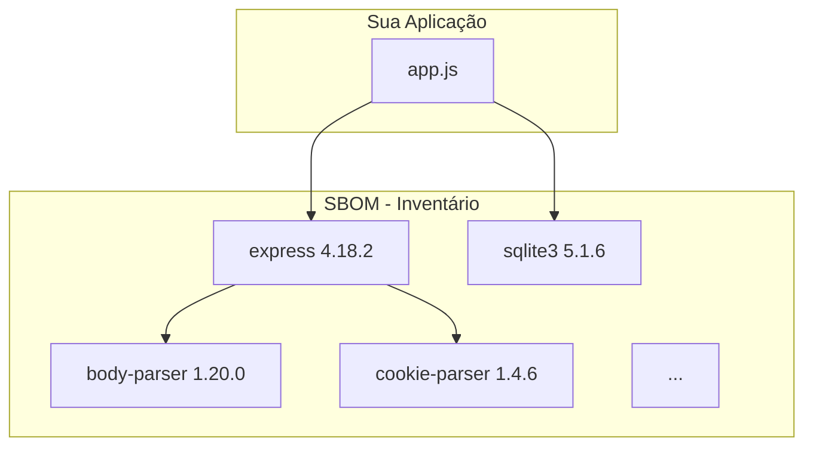
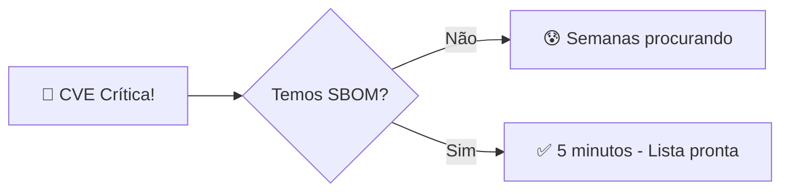

# 🎬 Vídeo 3.3 - SBOM (Software Bill of Materials)

**Aula**: 3 - SAST, SCA e SBOM  
**Vídeo**: 3.3  
**Temas**: SBOM; Inventário de dependências; CycloneDX; SPDX; Compliance

---

## 📚 Parte 1: O que é SBOM?

### Passo 1: Conceito de SBOM

**SBOM** = Software Bill of Materials (Lista de Materiais de Software)



**Analogia**: É como a lista de ingredientes em um alimento!
- Alimento → Aplicação
- Ingredientes → Dependências
- Lista → SBOM

---

### Passo 2: Por que SBOM é Importante?

**Cenário: Nova CVE crítica descoberta (tipo Log4Shell)**



**Sem SBOM:**
- "Usamos essa biblioteca?"
- "Em quais projetos?"
- "Qual versão?"
- ⏱️ Dias/semanas para identificar

**Com SBOM:**
- Consulta automatizada
- Lista de projetos afetados
- ⏱️ Minutos para identificar

---

### Passo 3: Casos de Uso

| Caso de Uso | Descrição |
|-------------|-----------|
| **Resposta a Incidentes** | Identificar rapidamente sistemas afetados por CVE |
| **Compliance** | Atender requisitos regulatórios (FDA, DoD) |
| **Licenças** | Garantir conformidade com licenças open source |
| **Fornecedores** | Exigir SBOM de software de terceiros |
| **Auditoria** | Rastrear origem de cada componente |

---

### Passo 4: Formatos de SBOM

| Formato | Foco | Organização |
|---------|------|-------------|
| **CycloneDX** | Segurança | OWASP |
| **SPDX** | Licenças | Linux Foundation |

**Ambos são JSON/XML e amplamente aceitos!**

**Exemplo CycloneDX:**
```json
{
  "bomFormat": "CycloneDX",
  "specVersion": "1.4",
  "components": [
    {
      "type": "library",
      "name": "express",
      "version": "4.18.2",
      "purl": "pkg:npm/express@4.18.2",
      "licenses": [
        { "license": { "id": "MIT" } }
      ]
    }
  ]
}
```

---

### Passo 5: O que é PURL?

**PURL** = Package URL (Identificador Universal de Pacote)

**Formato:** `pkg:<type>/<namespace>/<name>@<version>`

**Exemplos:**
```
pkg:npm/express@4.18.2         # Node.js
pkg:npm/sqlite3@5.1.6          # Node.js
pkg:pypi/flask@2.3.0           # Python
pkg:maven/org.apache.log4j/log4j-core@2.17.0  # Java
pkg:docker/nginx@1.25          # Docker
```

> 💡 PURL permite identificar pacotes de forma única em qualquer ecossistema!

---

## 🔍 Parte 2: Gerar SBOM com Trivy

### Passo 6: Gerar SBOM Localmente

**Linux/Mac:**
```bash
cd ~/fiap-devsecops/fiap-dclt-devsecops-aula03

# Gerar SBOM em formato CycloneDX
trivy fs . --format cyclonedx --output sbom.json

# Ver conteúdo
cat sbom.json | jq '.components[0:3]'
```

**Windows (PowerShell):**
```powershell
cd ~\fiap-devsecops\fiap-dclt-devsecops-aula03

# Gerar SBOM em formato CycloneDX
trivy fs . --format cyclonedx --output sbom.json

# Ver conteúdo
Get-Content sbom.json | ConvertFrom-Json | Select-Object -ExpandProperty components | Select-Object -First 3
```

---

### Passo 7: Analisar o SBOM

**Resultado esperado:**
```json
{
  "bomFormat": "CycloneDX",
  "specVersion": "1.4",
  "serialNumber": "urn:uuid:...",
  "version": 1,
  "metadata": {
    "timestamp": "2024-01-15T10:30:00Z",
    "tools": [
      { "name": "trivy", "version": "0.48.0" }
    ]
  },
  "components": [
    {
      "bom-ref": "pkg:npm/express@4.18.2",
      "type": "library",
      "name": "express",
      "version": "4.18.2",
      "purl": "pkg:npm/express@4.18.2",
      "licenses": [
        { "license": { "id": "MIT" } }
      ]
    },
    {
      "bom-ref": "pkg:npm/sqlite3@5.1.6",
      "type": "library",
      "name": "sqlite3",
      "version": "5.1.6",
      "purl": "pkg:npm/sqlite3@5.1.6"
    }
  ]
}
```

---

### Passo 8: Gerar SBOM em SPDX

**Linux/Mac:**
```bash
# Formato SPDX (foco em licenças)
trivy fs . --format spdx-json --output sbom-spdx.json

# Ver conteúdo
cat sbom-spdx.json | jq '.packages[0:2]'
```

---

## 🔄 Parte 3: Adicionar SBOM ao Pipeline

### Passo 9: Adicionar Job SBOM

**Editar `.github/workflows/security.yml`:**

**Linux/Mac:**
```bash
cat >> .github/workflows/security.yml << 'EOF'

  # ============================================
  # JOB: Gerar SBOM
  # ============================================
  sbom:
    name: 📦 Generate SBOM
    runs-on: ubuntu-latest
    
    steps:
      - name: 📥 Checkout
        uses: actions/checkout@v4

      - name: 📦 Generate SBOM (CycloneDX)
        uses: aquasecurity/trivy-action@master
        with:
          scan-type: 'fs'
          scan-ref: '.'
          format: 'cyclonedx'
          output: 'sbom-cyclonedx.json'

      - name: 📦 Generate SBOM (SPDX)
        uses: aquasecurity/trivy-action@master
        with:
          scan-type: 'fs'
          scan-ref: '.'
          format: 'spdx-json'
          output: 'sbom-spdx.json'

      - name: 📤 Upload SBOMs
        uses: actions/upload-artifact@v4
        with:
          name: sbom-reports
          path: |
            sbom-cyclonedx.json
            sbom-spdx.json
          retention-days: 90
EOF
```

---

### Passo 10: Commit e Push

**Linux/Mac:**
```bash
git add .github/workflows/security.yml
git commit -m "feat: adicionar geração de SBOM"
git push origin main
```

**Windows (PowerShell):**
```powershell
git add .github/workflows/security.yml
git commit -m "feat: adicionar geração de SBOM"
git push origin main
```

---

### Passo 11: Verificar Artifacts

1. GitHub > **Actions**
2. Workflow **Security Scan**
3. Baixar artifact `sbom-reports`

**Conteúdo:**
```
sbom-reports/
├── sbom-cyclonedx.json   # Foco em segurança
└── sbom-spdx.json        # Foco em licenças
```

---

## 📊 Parte 4: Usar SBOM para Buscar CVEs

### Passo 12: Escanear SBOM Existente

**Se você tem um SBOM, pode escaneá-lo:**

```bash
# Escanear SBOM para encontrar CVEs
trivy sbom sbom-cyclonedx.json
```

**Resultado:**
```
sbom-cyclonedx.json (cyclonedx)
===============================
Total: X (HIGH: X, CRITICAL: X)

┌──────────┬────────────────┬──────────┐
│ Library  │ Vulnerability  │ Severity │
├──────────┼────────────────┼──────────┤
│ example  │ CVE-XXXX-XXXXX │ HIGH     │
└──────────┴────────────────┴──────────┘
```

> 💡 Se não houver CVEs, significa que as dependências estão atualizadas!

---

## 🏛️ Parte 5: Compliance e Regulamentações

### Passo 13: Requisitos Legais

**Quem exige SBOM:**

| Entidade | Requisito |
|----------|-----------|
| **US Executive Order 14028** | Software vendido ao governo federal |
| **FDA** | Dispositivos médicos com software |
| **EU Cyber Resilience Act** | Produtos digitais na UE |
| **NTIA** | Guidelines para SBOM |

> 💡 Mesmo que não seja obrigatório para você AGORA, é uma boa prática ter!

---

## 🔧 Troubleshooting

| Erro | Causa | Solução |
|------|-------|---------|
| SBOM vazio | Não encontrou dependências | Verificar se `package-lock.json` existe (execute `npm install`) |
| Formato inválido | Versão antiga do Trivy | Atualizar Trivy |
| Licença desconhecida | Pacote sem metadados | Adicionar manualmente |

---

## ✅ Checkpoint

Ao final deste vídeo você deve ter:

- [ ] Entender o que é SBOM
- [ ] Conhecer formatos CycloneDX e SPDX
- [ ] Saber o que é PURL
- [ ] Gerar SBOM localmente
- [ ] SBOM sendo gerado no pipeline
- [ ] Artifacts disponíveis para download

---

## 📖 Leitura Complementar

- [CycloneDX Specification](https://cyclonedx.org/specification/)
- [SPDX Specification](https://spdx.dev/)
- [NTIA SBOM Guidelines](https://ntia.gov/sbom)

---

**FIM DO VÍDEO 3.3** ✅
